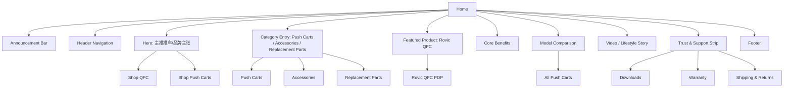
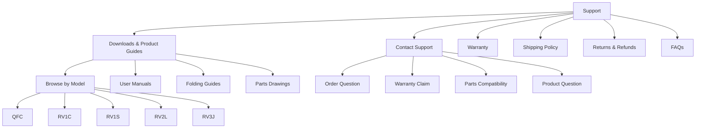

# Rovic Sports USA 信息架构图

版本：v1.0  
日期：2026-09-07  
对象：https://www.rovicsportsusa.com/  
目标：基于现有 Shopify 模板和现有内容，重组为可上线售卖的品牌官网信息架构。

## 1. 当前内容盘点

当前站点已有的主要内容资产：

1. 首页：Rovic 品牌主视觉、QFC/推车相关视觉内容、视频/图文模块、社交浮层、促销入口。
2. 商品：共 16 个产品，其中 Push Cart 5 个，Accessories 11 个。
3. 商品类型：
   - Push Cart：Rovic QFC、Rovic RV1C Compact、Rovic RV1S Swivel、Rovic RV2L Lite、Rovic RV3J Junior。
   - Accessories：Umbrella、Umbrella Holder、Replacement Wheel Set、Cart Storage Bag、Bag Straps、Bag Cover、Sand Bottle、Extended Seat、Wheel Cover、Shoe Brush 等。
4. 支持内容：Downloads & Product Guides 页面，已有部分 PDF/Parts Drawing 资源，但结构和按钮状态需要整理。
5. 品牌内容：About Our Brands 页面。
6. 联系内容：Contact Us 页面。
7. 政策内容：Privacy Policy 已存在；Shipping、Returns、Warranty、Terms 需要补齐或显性化。

## 2. IA 总原则

1. 首页不承担所有信息解释，只负责建立品牌信任、导购入口和主推产品。
2. 商品结构按用户任务组织：买推车、买配件、找替换零件、下载手册、联系支持。
3. Push Cart 和 Accessories 必须分层，否则用户很难判断自己是在看整车、配件还是售后零件。
4. QFC 是当前主推新品，应独立拥有导航入口、首页推荐位、商品详情模板和支持资源。
5. Downloads 属于 Support 体系，不应只作为孤立页面存在。
6. 所有商品详情页都应由 Shopify 后台产品字段、metafield、collection 和 theme section 统一驱动，避免每页手工拼内容。

## 3. 推荐站点地图

```mermaid
graph TD
  A[Rovic Sports USA]

  A --> H[Home 首页]
  A --> SHOP[Shop 商店]
  A --> QFC[QFC New Arrival]
  A --> CARTS[Push Carts]
  A --> ACC[Accessories]
  A --> SUP[Support]
  A --> ABOUT[About Our Brands]
  A --> SEARCH[Search]
  A --> ACCOUNT[Account]
  A --> CART[Cart / Checkout]

  SHOP --> ALL[All Products]
  SHOP --> SHOP_CARTS[Shop Push Carts]
  SHOP --> SHOP_ACC[Shop Accessories]
  SHOP --> SHOP_PARTS[Replacement Parts]

  QFC --> QFC_PDP[Rovic QFC PDP]
  QFC --> QFC_COLL[QFC Collection]
  QFC --> QFC_GUIDES[QFC Guides / Parts Drawing]

  CARTS --> CARTS_ALL[All Push Carts]
  CARTS --> CARTS_QFC[QFC Series]
  CARTS --> CARTS_RV[RV Series]
  CARTS --> CARTS_COMPACT[Compact]
  CARTS --> CARTS_LIGHT[Lightweight]
  CARTS --> CARTS_JUNIOR[Junior]

  CARTS_RV --> RV1C[Rovic RV1C Compact]
  CARTS_RV --> RV1S[Rovic RV1S Swivel]
  CARTS_RV --> RV2L[Rovic RV2L Lite]
  CARTS_JUNIOR --> RV3J[Rovic RV3J Junior]

  ACC --> ACC_ALL[All Accessories]
  ACC --> ACC_PARTS[Replacement Parts]
  ACC --> ACC_WEATHER[Weather Accessories]
  ACC --> ACC_STORAGE[Storage & Care]
  ACC --> ACC_COMFORT[Seats & Comfort]

  ACC_PARTS --> WHEEL[Replacement Wheel Set]
  ACC_PARTS --> STRAPS[Replacement Bag Straps]
  ACC_PARTS --> WHEELCOVER[RV1C Wheel Cover]
  ACC_WEATHER --> UMBRELLA[Rovic Golf Umbrella]
  ACC_WEATHER --> HOLDER[Adjustable Umbrella Holder]
  ACC_STORAGE --> BAG[Cart Storage Bag]
  ACC_STORAGE --> COVER[Golf Bag Cover]
  ACC_STORAGE --> BRUSH[Shoe Brush]
  ACC_COMFORT --> SEAT1[RV1 Series Extended Seat]
  ACC_COMFORT --> SEAT2[RV2L Extended Seat]

  SUP --> DOWNLOADS[Downloads & Product Guides]
  SUP --> CONTACT[Contact Support]
  SUP --> WARRANTY[Warranty]
  SUP --> SHIPPING[Shipping Policy]
  SUP --> RETURNS[Returns & Refunds]
  SUP --> FAQ[FAQs]

  CART --> CHECKOUT[Shopify Checkout]
```

## 4. 推荐全局导航

### 4.1 Header 主导航

建议顺序：

1. Shop
2. QFC New Arrival
3. Push Carts
4. Accessories
5. Support
6. About Our Brands

右侧工具：

1. Search
2. Account
3. Cart

说明：

1. 当前导航缺少 Accessories，但配件有 11 个产品，是真实售卖内容，应独立进入一级导航或 Shop 下拉。
2. Downloads 建议并入 Support，同时可以保留为 Support 下拉的第一项。
3. QFC New Arrival 可以保留为一级导航，因为它是新品和主推产品。
4. Push Carts 下拉不应只列抽象标签，也应能直接到核心型号或系列集合。

### 4.2 Header 下拉菜单

Shop：

1. All Products
2. Push Carts
3. Accessories
4. Replacement Parts

Push Carts：

1. All Push Carts
2. QFC Series
3. RV Series
4. Compact
5. Lightweight
6. Junior

Accessories：

1. All Accessories
2. Replacement Parts
3. Weather Accessories
4. Storage & Care
5. Seats & Comfort

Support：

1. Downloads & Product Guides
2. Contact Support
3. Warranty
4. Shipping
5. Returns
6. FAQs

## 5. 首页信息架构

首页目标：让用户知道 Rovic 卖什么、为什么可信、当前主推什么、下一步该去哪。

推荐首页模块顺序：

1. Announcement Bar：一句核心服务承诺，例如 Free U.S. shipping & returns。
2. Header：品牌 Logo、主导航、搜索、账户、购物车。
3. Hero：主推 Rovic QFC 或品牌步行高尔夫场景，CTA 指向 QFC 和 Push Carts。
4. Category Entry：Push Carts、Accessories、Replacement Parts 三个入口。
5. Featured Product：QFC 新品模块，展示关键卖点和颜色。
6. Model Comparison：用表格/卡片解释 QFC、RV1C、RV1S、RV2L、RV3J 差异。
7. Benefits：Compact folding、Stable movement、Bag compatibility、Accessory ecosystem。
8. Support Confidence：Shipping、Returns、Warranty、Downloads。
9. Newsletter 或优惠：仅在折扣规则真实时保留。
10. Footer。

## 6. 集合页信息架构

### 6.1 All Products

目标：承接 Shop 入口，允许用户快速分流。

结构：

1. 面包屑：Home / Shop / All Products。
2. 页面标题：Golf Push Carts & Accessories。
3. 简短说明：Shop Rovic push carts, replacement parts, and accessories for walking rounds。
4. 分类 tab：
   - All
   - Push Carts
   - Accessories
   - Replacement Parts
5. 筛选：
   - Product Type
   - Model Compatibility
   - Availability
   - Color
   - Feature
6. 排序：
   - Featured
   - Best selling
   - Price
   - Alphabetical
7. 商品网格。
8. SEO/品牌说明区，不能保留模板占位内容。

### 6.2 Push Carts Collection

目标：让用户比较整车。

结构：

1. 标题：Rovic Golf Push Carts。
2. 子分类：QFC Series、RV Series、Compact、Lightweight、Junior。
3. 商品卡片重点展示：型号、核心定位、价格、颜色、库存。
4. 对比入口：Compare Push Carts。

### 6.3 Accessories Collection

目标：让用户按用途和兼容型号找配件。

结构：

1. 标题：Rovic Accessories & Replacement Parts。
2. 子分类：
   - Replacement Parts
   - Weather Accessories
   - Storage & Care
   - Seats & Comfort
3. 筛选重点：
   - Compatible model
   - Product type
   - Availability

### 6.4 QFC New Arrival Collection

目标：只承接新品转化。

结构：

1. QFC 主推集合页或直接跳转 QFC PDP。
2. 如使用集合页，应只放 QFC 本体和 QFC 兼容配件。
3. 增加 QFC 对比、手册、配件推荐入口。

## 7. 商品详情页信息架构

### 7.1 Push Cart PDP 模板

适用于：QFC、RV1C、RV1S、RV2L、RV3J。

```mermaid
graph TD
  PDP[Push Cart PDP]
  PDP --> GALLERY[Product Gallery]
  PDP --> BUYBOX[Buy Box]
  BUYBOX --> TITLE[Title / Vendor]
  BUYBOX --> PRICE[Price]
  BUYBOX --> VARIANT[Color Variant]
  BUYBOX --> STOCK[Stock / Backorder]
  BUYBOX --> ATC[Add to Cart / Buy Now]
  BUYBOX --> TRUST[Shipping / Warranty / Trial]

  PDP --> SPECS[Key Specs]
  SPECS --> WEIGHT[Weight]
  SPECS --> FOLDED[Folded Dimensions]
  SPECS --> WHEELS[Wheel Configuration]
  SPECS --> BRAKE[Brake Type]
  SPECS --> BAG[Bag Compatibility]

  PDP --> FEATURES[Feature Story Sections]
  PDP --> COMPARE[Compare Models]
  PDP --> INCLUDED[What's Included]
  PDP --> ACCESSORIES[Compatible Accessories]
  PDP --> DOWNLOADS[Manuals / Parts Drawings]
  PDP --> FAQ[Product FAQ]
  PDP --> RECOMMENDED[Recommended Products]
```

Buy box 必须包含：

1. 产品名。
2. 一句话定位。
3. 真实价格。
4. 颜色/变体。
5. 库存或预售状态。
6. Add to cart。
7. Shipping、Returns、Warranty 入口。

Key Specs 必须包含：

1. Weight。
2. Folded dimensions。
3. Open dimensions。
4. Wheel configuration。
5. Brake type。
6. Bag compatibility。
7. Included accessories。
8. Compatible accessories。

### 7.2 Accessory PDP 模板

适用于：Umbrella、Wheel Set、Storage Bag、Bag Straps、Bag Cover、Sand Bottle、Umbrella Holder、Seat、Wheel Cover、Shoe Brush。

结构：

1. Gallery。
2. Buy box。
3. Compatibility：Compatible with 哪些型号。
4. Use case：解决什么问题。
5. Installation / Care。
6. Shipping & Returns。
7. Related products。

配件页必须避免只写 “Confirm fit before purchase”，而要用结构化字段明确显示兼容型号。

## 8. Support 信息架构

Downloads 页面建议结构：

1. 标题：Downloads & Product Guides。
2. 搜索或型号快速入口。
3. 资源类型卡片：User Manuals、Folding Guides、Parts Drawings、Warranty & Care。
4. 按型号分组资源。
5. 无资源的型号显示 Coming soon，不展示假按钮。
6. 不确定型号时，引导联系支持并要求用户提供照片/序列号。

Contact 页面建议结构：

1. 标题：Contact Rovic Support。
2. 说明用户应提供的信息：订单号、型号、照片、序列号。
3. 联系表单。
4. 真实邮箱、服务时间、响应时效。
5. 常见支持入口：Downloads、Warranty、Shipping、Returns。

## 9. Footer 信息架构

Footer 目标：提供二次导航、政策信任、客服入口和品牌信息。

推荐分组：

Shop：

1. All Products
2. Push Carts
3. Accessories
4. Replacement Parts
5. QFC New Arrival

Support：

1. Downloads
2. Contact Support
3. Warranty
4. Shipping Policy
5. Returns & Refunds
6. FAQs

Company：

1. About Our Brands
2. Privacy Policy
3. Terms of Service

Contact：

1. Support email。
2. Response time。
3. Social links，仅保留真实 Rovic 官方账号。

## 10. Shopify 后台内容模型

### 10.1 Product

每个商品必须配置：

1. Title。
2. Handle。
3. Product type。
4. Vendor：Rovic。
5. Description。
6. Media。
7. Price / Compare-at price。
8. SKU。
9. Inventory tracking。
10. Shipping weight。
11. SEO title / description。

### 10.2 Push Cart Metafields

建议新增产品 metafields：

1. `custom.model`
2. `custom.series`
3. `custom.generation`
4. `custom.weight`
5. `custom.folded_dimensions`
6. `custom.open_dimensions`
7. `custom.wheel_configuration`
8. `custom.brake_type`
9. `custom.bag_compatibility`
10. `custom.included_accessories`
11. `custom.compatible_accessories`
12. `custom.manual_pdf`
13. `custom.parts_drawing_pdf`
14. `custom.folding_guide_pdf`
15. `custom.warranty_summary`

### 10.3 Accessory Metafields

建议新增：

1. `custom.compatible_models`
2. `custom.installation_notes`
3. `custom.care_notes`
4. `custom.part_type`
5. `custom.manual_pdf`
6. `custom.related_products`

### 10.4 Automated Collections

建议用 Shopify 自动集合规则维护：

1. All Products：所有 active 产品。
2. Push Carts：Product type = Push Cart。
3. Accessories：Product type = Accessories。
4. Replacement Parts：Tag contains `replacement-part`。
5. QFC New Arrival：Tag contains `status:new-arrival` 或 `model:qfc`。
6. RV Series：Tag contains `series:rv`。
7. Compact：Tag contains `feature:compact`。
8. Lightweight：Tag contains `feature:lightweight`。
9. Junior：Tag contains `fit:junior`。
10. Weather Accessories：Tag contains `weather`。
11. Storage & Care：Tag contains `storage` 或 `cleaning`。
12. Seats & Comfort：Tag contains `seating` 或 `comfort`。

## 11. 上线 MVP 信息架构

如果只做第一版上线，建议优先保留以下结构：

1. Home。
2. Shop / All Products。
3. QFC New Arrival。
4. Push Carts。
5. Accessories。
6. Downloads。
7. Contact Support。
8. About Our Brands。
9. Shipping / Returns / Warranty / Privacy / Terms。
10. Product Detail Pages。
11. Cart / Checkout。

暂缓：

1. 过多的品牌故事时间线。
2. 复杂的博客内容。
3. 过多营销弹窗。
4. 不确定真实性的折扣浮层。

## 12. 与现有修复 PRD 的关系

本信息架构文档定义“站点应该如何组织”。  
已有 `rovic_ux_bug_prd.md` 定义“当前具体哪些地方需要修”。  

上线执行时建议先按本 IA 建结构，再用 `rovic_ux_bug_prd.md` 做逐项清理和验收。
